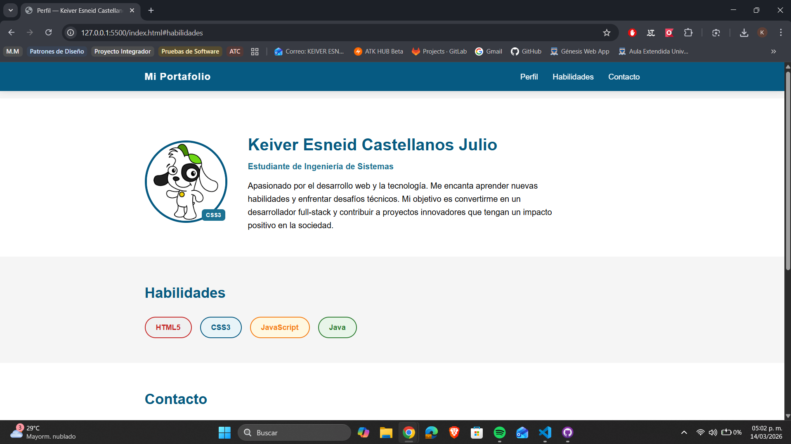

# castellanos-post1-u3

## Nombre del estudiante

Keiver Esneid Castellanos Julio

## Descripción del proyecto

Este proyecto es un portafolio web personal realizado como parte de la Unidad 3. Incluye una página principal con información de perfil, habilidades y un formulario de contacto, utilizando HTML5 y CSS3.

## Instrucciones para abrir el proyecto localmente

1. Descarga o clona este repositorio en tu computadora.
2. Abre la carpeta del proyecto en Visual Studio Code.
3. Haz clic derecho sobre el archivo `index.html` y selecciona **"Open with Live Server"** (debes tener instalada la extensión Live Server).
4. El sitio se abrirá automáticamente en tu navegador predeterminado.

## Captura de pantalla del resultado final

